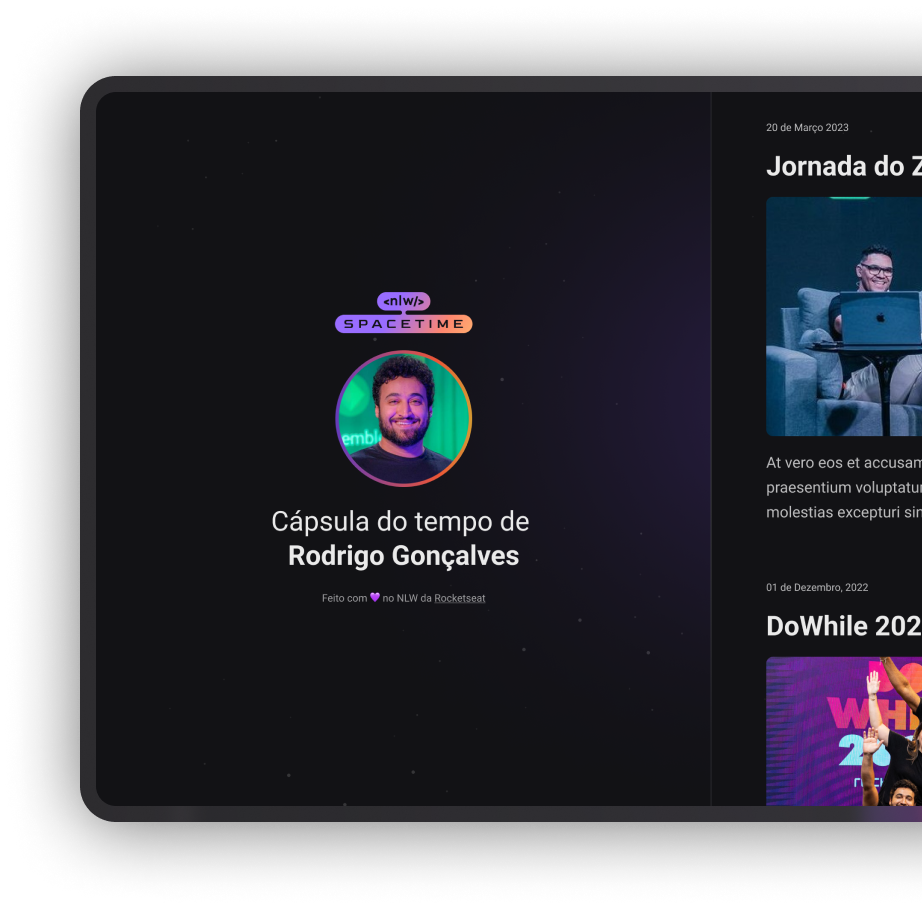

  

## 🖥️ Projeto

Esse é um Projeto Web Responsivo de uma cápsula do tempo para exibir memórias em uma linha do tempo.

## 🚀 Tecnologias

Esse projeto foi desenvolvido durante a NLW da Rocketseat com as seguintes tecnologias:

- HTML
- CSS
- Git e Github

## 🏷️ Layout

Você pode visualizar o layout do projeto através
[desse link](<https://www.figma.com/file/NsjIPKkv7uIPKIWoGbauK6/C%C3%A1psula-do-tempo-%E2%80%A2-Trilha-Explorer-(Community)?type=design&node-id=306%3A3&t=b5hpDZhI6drtZwKl-1>).
É necessário ter uma conta no [Figma](https://www.figma.com)
